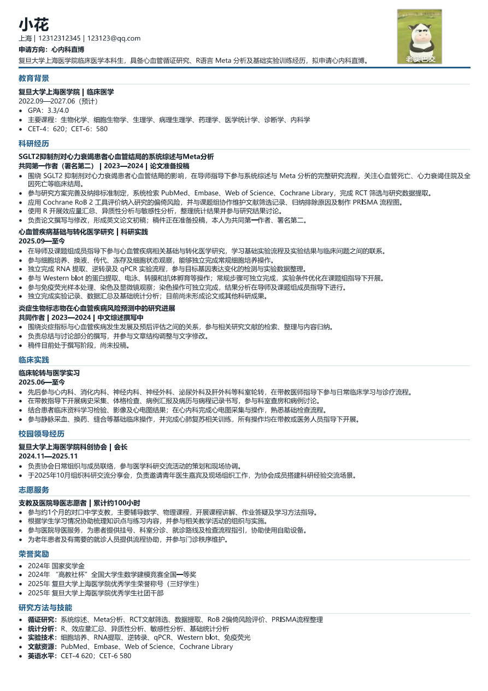

<h1 align="center">医学生的第一个简历助手</h1>

<p align="center">
  <a href="skill-lite/README.md"></a>
  
  
  
</p>

<p align="center"><b>简体中文</b> · <a href="README.en.md">English</a> · <a href="skill-lite/README.md">Skill Lite 使用说明</a></p>

<p align="center"><a href="docs/skill-hub/index.html">查看 Skill & Agent Hub</a> · <a href="docs/skill-hub/ecosystem-catalog/README.md">生态与竞品目录</a></p>

## Skill & Agent Hub

本仓库将稳定自研 Skill、在研网页 Agent 与公开生态参考分开呈现。外部项目仅用于发现和比较，不代表合作、推荐、兼容性或安全审计结论；详见[生态与竞品目录](docs/skill-hub/ecosystem-catalog/README.md)。

> **推荐入口：** [Medical Resume Skill Lite](skill-lite/README.md)
>
> 在 Codex、Claude Code 等已配置模型的本地对话中使用。它会基于已确认的真实经历进行多轮追问、按目标方向润色，并生成可编辑、可打印的 HTML 简历。

医学简历真正的难点，往往不是经历不够，而是研究方法、实验操作和实际贡献被压缩成一句“参与科研”。我们希望保留事实边界，把这些零散信息组织成目标方向看得懂、也经得起追问的能力证据。

> 真实经历 → 研究对象 / 方法 / 工具 / 实验技术 / 角色 / 交付物 → 可迁移能力 → 目标方向关注的表达重点

## 示例成品

下面是一份基于脱敏医学经历生成的简历示例，用于展示信息组织、表达密度与 A4 打印效果。



[查看示例 PDF](examples/medical-resume-skill-example.pdf)

> 示例仅用于展示排版与表达结构。姓名、联系方式、头像、机构、课题与成果信息均为脱敏或示例内容，请勿将其视为真实投递材料。

## 选择入口

| 入口 | 当前状态 | 适合的情况 |
| --- | --- | --- |
| [Skill Lite](skill-lite/README.md) | **推荐使用**。支持对话式经历梳理、受约束润色、表达版本比较与本机 HTML 简历交付。 | 已安装 Codex、Claude Code 或兼容 AI 工作流的用户 |
| [网页 Agent 工作台](#网页体验版) | **Beta**。已接入现有对话 Agent、v2 活动责任模型、Claim Gate、A4 预览与本机交付。 | 希望在浏览器中逐步确认事实、审计要点并导出简历的用户 |

两种入口共享“先确认事实、再翻译表达”的原则和版本化工作流契约，但不要求同时安装。Skill Lite 仍是优先维护的交付路径；网页版本是现有对话 Agent 的可视化入口，不再维护另一套简历大脑。

## Skill Lite 能做什么

Skill 默认先确认事实，再按目标方向规划每段经历，并提供稳妥版、专业版和高竞争力版供比较。信息密度来自背景、职责、方法、工具、质控、协作和产出等已确认事实，不来自重复句或虚构数字。

- 从零梳理一段零散的医学科研、实验或实践经历；
- 局部润色已有简历中的一到三条经历；
- 按学术申请、临床科研、医学事务 / MSL、医疗数据与健康科技、临床运营协调、CRA 支持与 CDM 支持等方向调整表达重点；
- 用户确认后，生成本机可编辑、可打印的 A4 HTML 简历。

- [Skill Lite 使用说明](skill-lite/README.md)
- [Skill 入口](skill-lite/medical-resume-skill/SKILL.md)

Skill Lite 是供 Codex、Claude Code 等 AI 编程助手调用的提示词、流程与知识资产，本身不包含 API Key 或独立模型接口。网页 Agent 从 Python 包内读取同版本工作流契约；仓库测试保证这份运行时副本与 Skill 契约同步，但运行时不依赖 `skill-lite/**` 文件路径。网页继续复用同一套对话编排、v2 活动责任模型和 Claim Gate。安装和调用方式见 [Skill Lite 使用说明](skill-lite/README.md)。

| 你提供什么 | 系统如何处理 | 你拿到什么 |
| --- | --- | --- |
| 一段真实的医学经历 | 提取事实、追问缺失信息、等待确认 | 按目标方向生成的候选简历要点 |
| 一段包含方法、工具或实验技术的经历 | 分别识别 MR/Meta 等研究方法、R/Python 等分析工具、qPCR/WB 等实验技术，以及 PubMed/Embase 等检索资源 | 可解释的能力结构，而不是关键词堆砌 |
| 你的目标方向 | 调整表达重点，不改写真实经历 | 可追溯、可编辑、可核查的材料 |

## 网页体验版

> 网页 Agent 当前提供证据绑定的完整纵向链路：基础资料与教育背景确认、逐段经历采集、独立证据与责任边界、代表样板确认、多段经历组合、要点审计、A4 预览和交付包下载。用户看到「聊经历、定表达、完成简历」三个阶段；后端仍使用六个受审计 gate，且不会引入第二套状态机。

### 快速开始

```powershell
.\start-local.ps1
```

然后打开：`http://127.0.0.1:5000/`

首次使用可载入内置的脱敏 Meta 分析示例。完整安装步骤见[在自己的电脑上运行网页体验版](#在自己的电脑上运行网页体验版)。

## 适用场景

医学科研和临床经历往往同时包含研究问题、方法、软件工具、实验技术和执行工作。若简历只保留“参与科研”“负责文献检索”或“协助数据分析”等概括性描述，读者很难判断具体的工作内容和责任边界。

页面将原始经历整理为可确认事实，包括研究设计、分析方法、工具、实验技术、临床研究流程、个人角色、数据或文献来源与交付物。用户确认后，系统再生成对应方向的候选要点。

## 初版医学能力分类

项目目前按下列维度整理医学经历中的能力信息。它们用于帮助用户确认事实和选择表达重点，不代表仅凭关键词即可认定掌握某项能力。

1. **研究设计与方法**：队列研究、RCT、Meta 分析、孟德尔随机化（MR）、GWAS、生物信息学、机器学习等；
2. **数据与工具**：R、Python、SPSS、SQL、数据清洗、统计分析与可视化等；
3. **临床研究设计与执行**：入排标准、随访、CRF、伦理、GCP、真实世界研究与数据质控等；
4. **实验技术**：细胞培养、qPCR、Western Blot、流式细胞术、ELISA、动物实验等；
5. **医学证据与信息能力**：PubMed、Embase、Cochrane 检索、指南解读、证据分级与医学写作等。

## 使用流程

1. 输入一段真实医学经历，或载入内置的脱敏 Meta 分析示例。
2. 查看候选事实与最多 3 个澄清问题。
3. 确认、修改或拒绝事实；未确认信息不会被静默升级成经历。
4. 选择目标方向，按已确认事实生成足量且不重复的候选简历要点。
5. 查看依据事实、风险提示和审计记录，再复制或导出使用。

### Career coverage / 岗位覆盖

当前 canonical source 共有 10 个方向：学术申请、临床科研、MSL / 医学事务、医疗数据 / 健康科技、临床运营协调、CRA 支持、CDM 支持、医疗器械临床 / 应用支持、药物警戒 / 药物安全支持，以及法规医学写作支持。Canonical source 表示该 Role Pack 已完成职业语义和边界的 domain validation；它不自动成为 runtime target，也不代表已完成 Cross-model validation。Market Access、Healthcare Product、Healthcare Consulting、Commercial / Business Analytics、Healthcare / Project Operations 与 Medical Sales / Commercial 等差异较大的方向仍通过 JD-driven Generalist 路径处理，不强行套用通用 Role Pack。

岗位边界、真实 JD 证据、成熟度和下一阶段路线图见[中国医学背景职业 Role Pack 版图](docs/CAREER_ROLE_PACK_LANDSCAPE.md)；关系型数据库的导入边界、版本与 provenance 见[医学职业地图关系型数据库 v1](docs/CAREER_MAP_DATABASE.md)。canonical 数量与语义始终以 `data/role-packs/*.json` 为准。

## 使用规则与已知限制

- 候选要点只使用用户确认的事实；系统不会将“参与”改写为“主导”，也不会补充未提供的数字、方法、工具或结果。
- 能力分类用于解释经历，不用于仅凭关键词判断熟练度。R/Python、MR/Meta、qPCR/WB 和 PubMed/Embase 分别属于不同类别，需结合用户说明确认。
- 当前文件提取适合普通 DOCX、TXT、Markdown 和带可复制文字的 PDF。双栏、复杂表格和扫描件 PDF 的文本顺序可能不可靠，应在确认页人工校正。
- 本地 Beta 不提供录用、薪资或岗位匹配结论，也不复刻任意既有简历的视觉版式。

## 在自己的电脑上运行网页体验版

### 需要什么

- Windows 10/11（首发启动脚本面向 Windows）
- Python 3.11 或更高版本
- 网络仅用于首次安装 Python 依赖；之后网页和经历处理在本机运行

### 最快启动

1. 下载仓库 ZIP 并解压，或执行：

   ```powershell
   git clone https://github.com/melody-yu112358/medical-resume-agent.git
   cd medical-resume-agent
   ```

2. 在项目目录打开 PowerShell 后运行：

   ```powershell
   .\start-local.ps1
   ```

   首次运行会安装所需依赖。若 PowerShell 阻止脚本，请只对当前窗口执行：

   ```powershell
   Set-ExecutionPolicy -Scope Process Bypass
   .\start-local.ps1
   ```

3. 看到服务启动提示后，在浏览器打开：

   ```text
   http://127.0.0.1:5000/
   ```

4. 用完后回到 PowerShell，按 `Ctrl + C` 停止本地服务。

### 可选：模型表达优化

不配置模型也可体验确定性事实提取、确认、岗位要点生成和审计流程。若希望启用 OpenAI-compatible 模型（例如 DeepSeek）的受约束表达优化，先执行：

```powershell
Copy-Item .env.example .env
```

再按照 [模型配置说明](docs/LLM_INTEGRATION.md) 在本机 `.env` 中填写自己的密钥。`.env` 已被 Git 忽略，绝不要把密钥粘贴到网页、截图或 GitHub Issue 中。

## 验证

```powershell
python -m pip install -e ".[resume_extract,dev,schema_validation]"
python -m pytest -q
```

当前共享发布源包含完整的单元、接口与端到端测试套件；实际数量以 `pytest -q` 的收集结果为准，避免文档数字随新增测试失效。发布前还应完成浏览器冒烟测试：载入示例、提取事实、确认、选择方向、生成要点、查看证据并导出。

## 仓库结构

```text
demo/resume-agent/         对话 Agent 的事实确认、审计、预览与导出工作台
demo/experience-compiler/  保留的医学经历编译器 Demo
src/medical_career_agent/  经历提取、确认、要点生成、Claim Gate 与账本服务
schemas/                   canonical experience、role pack、bullet claim 数据契约
data/role-packs/           canonical Role Pack 表达策略（当前集合以 JSON 为准）
skill-lite/                面向 Codex/Claude 用户的轻量工作流包
docs/                      架构、边界、模型配置与验收材料
tests/                     合成案例、接口与边界测试
```

## 贡献与测试

欢迎医学生、医学相关专业研究生，以及关注医学科研、升学或医疗行业发展的朋友，使用已脱敏的经历参与测试。请勿提交真实姓名、联系方式、病历、受试者信息、未公开研究数据或任何密钥。
