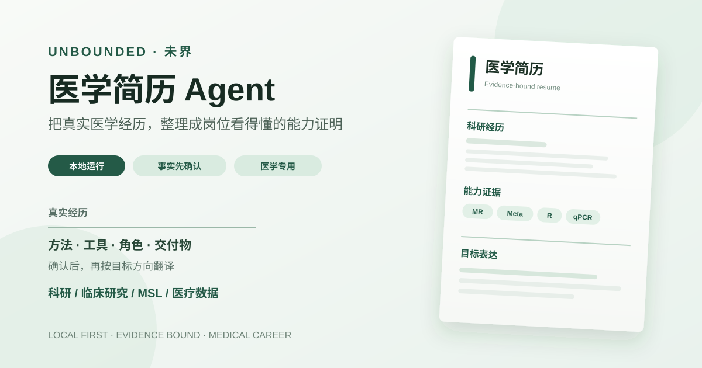
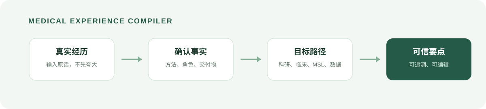

<p align="center">
  
</p>

<p align="center">
  <a href="#在自己的电脑上运行"></a>
  
  
  
</p>

<p align="center"><b>简体中文</b> · <a href="README.en.md">English</a> · <a href="skill-lite/README.md">Skill Lite</a></p>

一个可在自己电脑上运行的医学经历编译器，面向医学生的申学与秋招场景。

它不会把一段经历直接“润色得更厉害”。它先帮助用户确认真实事实，再把同一段医学经历整理成不同目标方向看得懂、经得起追问的简历要点。

> 真实经历 → 方法 / 工具 / 角色 / 研究对象 / 交付物 → 可迁移能力 → 目标方向的表达重点

<p align="center">
  
</p>

| 你提供什么 | 系统如何处理 | 你拿到什么 |
| --- | --- | --- |
| 一段真实的医学经历 | 提取事实、追问缺失信息、等待确认 | 按目标方向生成的候选简历要点 |
| MR / Meta / R / qPCR 等线索 | 区分方法、工具、实验技术与证据资源 | 可解释的能力结构，而不是关键词堆砌 |
| 你的目标路径 | 改变表达重点，不改写真实经历 | 可追溯、可编辑、可核查的材料 |

## 30 秒体验

```powershell
.\start-local.ps1
```

然后打开：`http://127.0.0.1:5000/demo/experience-compiler/index.html`

第一次可直接载入内置的脱敏 Meta 分析示例。完整步骤见[在自己的电脑上运行](#在自己的电脑上运行)。

## 为什么做这个？

“参与科研”“负责文献检索”“协助数据分析”并不能说明你实际会什么，也难以让导师、医院科研岗或医药行业岗位判断你的能力边界。

未界先把原始经历拆成可确认事实：研究设计、分析方法、工具、湿实验技术、临床研究流程、个人角色、数据/文献来源与交付物。用户确认后，系统才会生成对应方向的候选要点。

## 当前可用流程

1. 输入一段真实医学经历，或载入内置的脱敏 Meta 分析示例。
2. 查看候选事实与最多 3 个澄清问题。
3. 确认、修改或拒绝事实；未确认信息不会被静默升级成经历。
4. 选择目标方向，生成 1–3 条候选简历要点。
5. 查看依据事实、风险提示和审计记录，再复制或导出使用。

首发 Beta 支持四个方向：

- **科研 / 考博与学术申请**：研究问题、方法深度与科研潜力。
- **临床研究**：研究设计、临床问题、执行与协作。
- **医学事务 / MSL**：证据解读、疾病领域知识与医学信息转译。
- **医疗 AI / 医学数据**：数据处理、分析框架与结果沟通。

## 保真边界

- 不把“参与”写成“主导”，不编造数字、工具、方法或结果。
- R/Python 是工具；MR/Meta 是方法；qPCR/WB 是实验技术；PubMed/Embase 是证据检索资源。系统不会把它们混成一类泛泛的“科研技能”。
- 强表达必须回到用户确认的事实与证据；信息不足时，系统提示补充，而不是猜测。
- 目前适合普通电子版 DOCX、TXT、Markdown 和带可复制文字的 PDF。复杂双栏、表格化或扫描件 PDF 可能需要在确认页人工校正。
- 本地 Beta 不承诺录用、薪资、岗位匹配或任意简历版式复刻。

## 在自己的电脑上运行

### 需要什么

- Windows 10/11（首发启动脚本面向 Windows）
- Python 3.11 或更高版本
- 网络仅用于首次安装 Python 依赖；之后网页和经历处理在本机运行

### 最快启动

1. 下载仓库 ZIP 并解压，或执行：

   ```powershell
   git clone https://github.com/melody-yu112358/medical-resume-agent.git
   cd medical-resume-agent
   ```

2. 在项目目录打开 PowerShell 后运行：

   ```powershell
   .\start-local.ps1
   ```

   首次运行会安装所需依赖。若 PowerShell 阻止脚本，请只对当前窗口执行：

   ```powershell
   Set-ExecutionPolicy -Scope Process Bypass
   .\start-local.ps1
   ```

3. 看到服务启动提示后，在浏览器打开：

   ```text
   http://127.0.0.1:5000/demo/experience-compiler/index.html
   ```

4. 用完后回到 PowerShell，按 `Ctrl + C` 停止本地服务。

### 可选：模型表达优化

不配置模型也可体验确定性事实提取、确认、岗位要点生成和审计流程。若希望启用 OpenAI-compatible 模型（例如 DeepSeek）的受约束表达优化，先执行：

```powershell
Copy-Item .env.example .env
```

再按照 [模型配置说明](docs/LLM_INTEGRATION.md) 在本机 `.env` 中填写自己的密钥。`.env` 已被 Git 忽略，绝不要把密钥粘贴到网页、截图或 GitHub Issue 中。

## 面向 Codex/Claude 用户的 Skill Lite

网页适合不想配置 AI 工具的用户；仓库也提供轻量 Skill，适合在 Codex 或 Claude 中进行更深入的“经历问诊”：

- [Skill Lite 使用说明](skill-lite/README.md)
- [Skill 入口](skill-lite/medical-resume-skill/SKILL.md)

Skill Lite 复用了本项目的核心方法：先拆事实、再确认、最后按目标方向翻译。它是提示词与工作流包，不替代网页中的 Claim Gate 和审计能力。

## 验证

```powershell
python -m pip install -e ".[resume_extract,dev,schema_validation]"
python -m pytest -q
```

当前共享发布源包含 205 项单元、接口与端到端测试。发布前还应完成浏览器冒烟测试：载入示例、提取事实、确认、选择方向、生成要点、查看证据并导出。

## 仓库结构

```text
demo/experience-compiler/  可直接体验的医学经历编译器页面
src/medical_career_agent/  经历提取、确认、要点生成、Claim Gate 与账本服务
schemas/                   canonical experience、role pack、bullet claim 数据契约
data/role-packs/           四个目标方向的表达策略
skill-lite/                面向 Codex/Claude 用户的轻量工作流包
docs/                      架构、边界、模型配置与验收材料
tests/                     合成案例、接口与边界测试
```

## 贡献与测试

欢迎医学生、科研生、临床研究从业者、MSL 与医疗数据方向同学使用真实但已脱敏的经历测试。请勿提交真实姓名、联系方式、病历、受试者信息、未公开研究数据或任何密钥。
