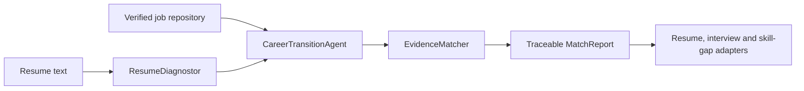
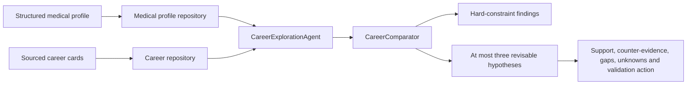
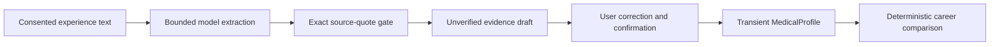

# Architecture v0.1

## Goal

Build an evidence-based career transition system around real job postings,
salary evidence, resumes, and application feedback. The architecture borrows
PAEG's separation of deterministic diagnosis/evaluation from LLM generation,
without carrying over education-specific modules.

## First vertical slice

The first implemented flow is `resume + job_id -> match report`. It runs without
an LLM, so scores and evidence can be reproduced in tests.

## Career comparison slice

The second deterministic slice is implemented separately from the resume-to-job
flow:

`career-comparison-v0.1` calculates evidence coverage for explicit capability
groups. The percentage is not a fit, personality, employability, salary, or
success score. Every component returns the profile evidence IDs and career
source IDs used in the inference.

Interest statements do not increase evidence coverage. Current career cards do
not prove live openings in a user's preferred city, so location availability is
returned as unknown. Travel non-negotiables can currently deprioritize MSL and
CRA only because the stored work-environment claims support that caution; the
exact frequency must still be checked against a current job posting.

This slice is exposed through deterministic `POST /api/career-comparisons` and
the local integration page. It accepts either a source-controlled synthetic
`profile_id` or a confirmed transient profile in the request body.

## Transient profile-intake slice

`POST /api/profile-drafts` sends only the current intake fields to the
configured model. Every proposed evidence item must contain a continuous quote
that exists verbatim in the supplied experience text and may use only the
capability vocabulary known to the deterministic comparator. The backend
rejects ungrounded quotes, unsupported labels and malformed output.

The draft is not a profile until the user confirms individual evidence items.
Confirmed profiles are carried in the next request and are not written to the
JSON profile repository. This local validation slice has no account, session
database or cross-device persistence.

## Layers

| Layer | Responsibility | Must not do |
| --- | --- | --- |
| `domain` | Job, profile, career, evidence, match and hypothesis contracts | HTTP or file I/O |
| `services` | Deterministic diagnosis, evidence matching and career comparison | Invent user or market facts |
| `application` | Workflow orchestration and trace | Know storage details |
| `ports` | Interfaces for jobs, careers, profiles and models | Implement vendors |
| `adapters` | JSON now; database/search/model later | Contain product rules |
| `api` | Request validation and serialization | Perform matching itself |

## PAEG concept mapping

| PAEG | Medical career system |
| --- | --- |
| Diagnostor | Resume and career-evidence diagnosis |
| ResourceLibrarian | Verified job and salary retrieval |
| Planner | Target selection and application planning |
| Evaluator | JD evidence matching and interview evaluation |
| Adapter | Resume, skills and strategy adjustment |
| Individuality | Persistent career-transition profile |
| Context bundle | Resume, target, job, source and prior feedback bundle |

## Data rules

- Every real job and salary record must include source URL and collection date.
- Salary ranges are observations, never generated by an LLM.
- Synthetic fixtures must carry `synthetic: true` and cannot feed market claims.
- Resume output must distinguish user evidence, inference, missing information,
  and generated wording.
- Raw resumes and interview recordings stay outside Git.

## Extension points

1. Replace `JsonJobRepository` with PostgreSQL and a search index.
2. Add a job-ingestion pipeline with source policy, deduplication, expiration,
   and salary normalization.
3. Add document readers behind a resume-extraction port.
4. Add an LLM gateway only for structured extraction and wording generation.
5. Add application feedback events to update the profile and recommendations.

## Career-map SQL projection

The canonical Role Pack JSON files remain the editable occupational source of
truth. `database/career_map_schema.sql` and
`scripts/import_role_packs_to_career_map.py` provide a separate, rebuildable
relational projection for versions, capability priorities, evidence gates,
negative mappings, expression policies and evaluation-case definitions.

This projection is not a new runtime repository and does not change routing,
Claim Gate, Confirmation Gate or matching behavior. It distinguishes
`canonical_v1` domain status from runtime enablement and Cross-model validation,
retains the original JSON artifact and SHA-256 provenance. Three source-controlled
pilot career cards (PV, regulatory medical writing and CRA support) additionally
project frozen public-JD excerpts into a separate evidence layer. This layer
records source URL, capture date, raw excerpt and digest, is not live job
ingestion, and cannot change Role Pack semantics or runtime routing. Transition
cases and persistent Career Profiles remain unpopulated until their source and
consent rules are separately implemented. See
`docs/CAREER_MAP_DATABASE.md` for the migration contract and query examples.

## Acceptance for v0.1

- A synthetic resume and job produce a deterministic report.
- Each match points back to resume evidence.
- Missing requirements remain visible.
- Synthetic data cannot be mistaken for live market evidence.
- Storage and model vendors can be replaced without changing domain rules.

## Acceptance for career comparison v0.1

- The same profile and career records always produce the same result.
- No more than three hypotheses are returned.
- Every support item points to an existing profile `evidence_id`.
- Every capability component points to source IDs in the career card.
- Missing capability groups, sourced counter-evidence and unknowns remain
  visible.
- Supported hard constraints affect ordering before hypotheses are ranked.
- No LLM, personality inference or untraceable market claim participates in
  comparison.
