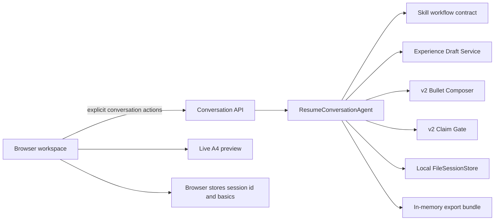

# Medical Resume Agent unified product slice

## Product boundary

This release connects the repository's Medical Resume Skill rules to one user-facing browser workflow. It is the first complete vertical slice for one confirmed experience, not a claim that every multi-experience resume scenario is finished.

The six mandatory gates are:

```text
intake → fact confirmation → representative sample → full composition → factual audit → delivery
```

The machine-readable contract lives in `skill-lite/medical-resume-skill/references/workflow-contract.json`. The Skill prose remains authoritative for evidence and responsibility boundaries. The browser reuses the existing `ResumeConversationAgent`, canonical-experience-v2 activity responsibilities and v2 Claim Gate; it does not introduce a second orchestration pipeline.

## Architecture



- The browser stores only the current local session id, preview preferences and candidate basics.
- The backend validates every stage transition and stores the active conversation as local session JSON; starting a new resume deletes that session and its claim ledger.
- The Skill package owns the shared stage/action vocabulary and writing boundaries.
- Existing legacy demos and APIs remain available; `/` opens the unified workspace.

## API surface

| Endpoint | Purpose |
| --- | --- |
| `GET /api/resume-agent/config` | Return the versioned Skill workflow contract. |
| `POST /api/conversations` | Create a local bounded conversation session. |
| `POST /api/conversations/<id>/messages` | Apply existing v2 fact, responsibility, composition, rewrite and audit actions. |
| `DELETE /api/conversations/<id>` | Delete the local session and claim ledger when starting over. |
| `POST /api/conversations/<id>/export` | Return accepted Markdown, HTML, structured data, evidence summary and instructions in memory. |

Export is refused until the conversation reaches delivery with at least one ClaimGate-ready bullet. The server does not create a second export folder or file copy.

## User experience

The workspace uses three coordinated areas:

1. a six-step navigator with privacy and progress status;
2. the current decision surface for input, confirmation, sample approval, tier choice or editing;
3. a sticky A4 preview with clinical, academic and ATS-friendly themes.

The default expression tier is professional. Conservative and high-impact versions use the same confirmed fact set. Selecting a stronger tier never confirms a new fact, and a Markdown edit always triggers another audit before export.

## Reference projects and adopted lessons

The design uses patterns from established open-source projects without copying their implementations:

- [Reactive Resume](https://github.com/AmruthPillai/Reactive-Resume): structured resume data, live preview, separate themes and local ownership.
- [JSON Resume](https://github.com/jsonresume/resume-schema): portable canonical data separated from rendering.
- [assistant-ui](https://github.com/assistant-ui/assistant-ui): explicit runtime actions and human approval surfaces.
- [CopilotKit](https://github.com/CopilotKit/CopilotKit): shared agent/UI state and human-in-the-loop interaction.

This slice stays on the existing Flask and vanilla JavaScript stack so it adds no frontend build service or deployment dependency.

## Acceptance levels

### Correctness

- No bullet is produced before fact confirmation.
- No responsibility level above `participated` is accepted without a concrete personal boundary.
- Unconfirmed numbers, responsibility upgrades, internal enum names and unresolved placeholders block export.
- Answers to clarification questions are re-extracted into the fact card.

### Usability

- A first-time user can reach delivery through all six visible stages.
- The user can compare three expression tiers, edit Markdown, see a live A4 preview and download a complete bundle.
- Workflow state survives a browser refresh on the same device.
- The layout remains usable on desktop and mobile widths.

### Optional optimization

- Multi-experience composition, account-based cross-device persistence and a richer host-model writing adapter are later iterations. They must reuse this contract instead of creating another resume brain.
