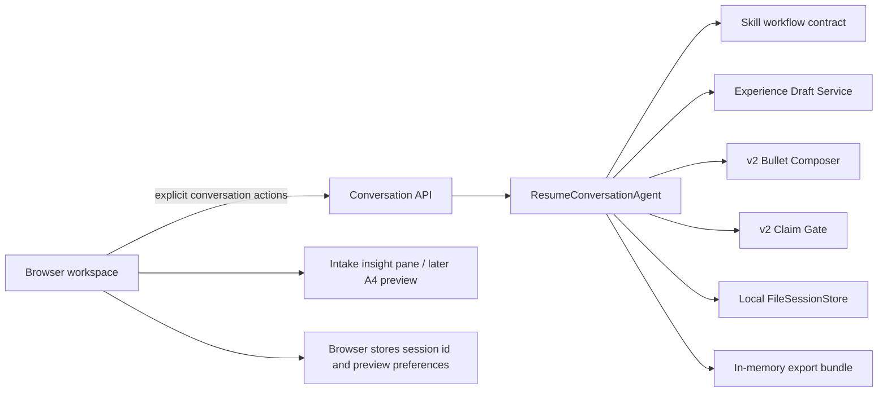

# Medical Resume Agent unified product slice

## Product boundary

This release connects the repository's Medical Resume Skill rules to one evidence-bound browser workflow for confirmed candidate profile data and multiple independently confirmed experiences. It supports the complete implemented slice; it does not claim account-based persistence, arbitrary profile schemas, or every resume edge case.

The six mandatory backend gates are:

```text
intake → fact confirmation → representative sample → full composition → factual audit → delivery
```

Users see three goal-oriented phases: `聊经历` maps to intake and fact confirmation, `定表达` maps to representative-sample review and composition, and `完成简历` maps to factual audit and delivery. The browser never creates a parallel workflow state.

The runtime contract is package-owned at `src/medical_career_agent/assets/workflow-contract.json`; a regression test keeps it semantically identical to `skill-lite/medical-resume-skill/references/workflow-contract.json`. The Skill prose remains authoritative for evidence and responsibility boundaries. The browser reuses the existing `ResumeConversationAgent`, canonical-experience-v2 activity responsibilities and v2 Claim Gate.

## Architecture



- The browser stores the current local session id and preview preferences. Confirmed candidate profile data belongs to the backend session and is evidence-bound like other resume content; legacy sessions retain a request-only basics fallback.
- The backend validates every stage transition and stores the active conversation as local session JSON; starting a new resume deletes that session and its claim ledger.
- The Skill package owns the shared stage/action vocabulary and writing boundaries.
- Existing legacy demos and APIs remain available; `/` opens the unified workspace.

## API surface

| Endpoint | Purpose |
| --- | --- |
| `GET /api/resume-agent/config` | Return the versioned package-owned mirror of the Skill workflow contract. |
| `POST /api/conversations` | Create a local bounded conversation session. |
| `POST /api/conversations/<id>/messages` | Apply existing v2 fact, responsibility, composition, rewrite and audit actions. |
| `DELETE /api/conversations/<id>` | Delete the local session and claim ledger when starting over. |
| `POST /api/conversations/<id>/export` | Return accepted Markdown, HTML, structured data, evidence summary and instructions in memory. |

Export is refused until the conversation reaches delivery with at least one ClaimGate-ready bullet. The server does not create a second export folder or file copy.

## User experience

The desktop workspace uses three coordinated areas:

1. a three-phase user navigator with privacy and local-save status;
2. one primary decision surface for profile questions, single-question fact enrichment, responsibility confirmation, sample approval, tier choice or editing;
3. an `已了解的你` insight pane during intake, replaced by a sticky A4 preview with clinical, academic and ATS-friendly themes after intake.

The intake question card supports backend-owned single- or multi-select options, free-text detail, and an explicit `不确定 / 不记得` answer. Activity-boundary review and raw candidate facts remain available in disclosure panels without competing with the current primary question.

The default expression tier is professional. Conservative and high-impact versions use the same confirmed fact set. Selecting a stronger tier never confirms a new fact, and a Markdown edit always triggers another audit before export.

## Reference projects and adopted lessons

The design uses patterns from established open-source projects without copying their implementations:

- [Reactive Resume](https://github.com/AmruthPillai/Reactive-Resume): structured resume data, live preview, separate themes and local ownership.
- [JSON Resume](https://github.com/jsonresume/resume-schema): portable canonical data separated from rendering.
- [assistant-ui](https://github.com/assistant-ui/assistant-ui): explicit runtime actions and human approval surfaces.
- [CopilotKit](https://github.com/CopilotKit/CopilotKit): shared agent/UI state and human-in-the-loop interaction.

This slice stays on the existing Flask and vanilla JavaScript stack so it adds no frontend build service or deployment dependency.

## Acceptance levels

### Correctness

- No bullet is produced before fact confirmation.
- No responsibility level above `participated` is accepted without a concrete personal boundary.
- Unconfirmed numbers, responsibility upgrades, internal enum names and unresolved placeholders block export.
- Answers to clarification questions are re-extracted into the fact card.

### Usability

- A first-time user can reach delivery through three visible phases while the backend enforces all six gates.
- The user can confirm candidate basics and education, add multiple typed experiences, switch between them without evidence contamination, and see what the system currently understands.
- Intake presents one primary question at a time, supports multiple preset answers and an unknown option, and never shows an empty A4 preview.
- The user can compare three expression tiers, edit Markdown, see a live A4 preview and download a complete bundle.
- Workflow state survives a browser refresh on the same device.
- The layout remains usable on desktop and mobile widths.

### Optional optimization

- Multiple education records, account-based cross-device persistence and a richer host-model writing adapter are later iterations. They must reuse this contract instead of creating another resume brain.
